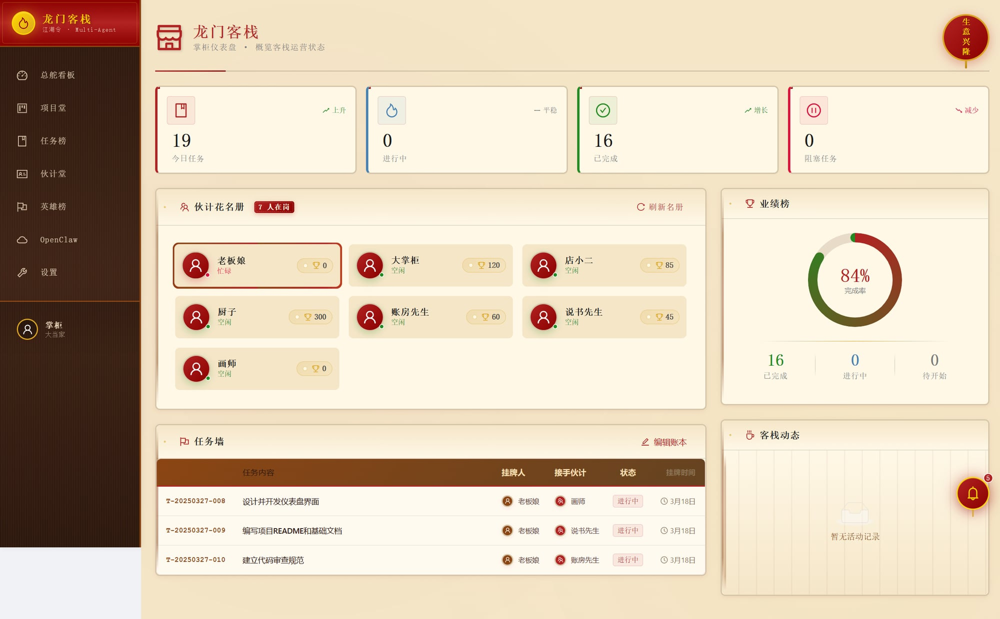
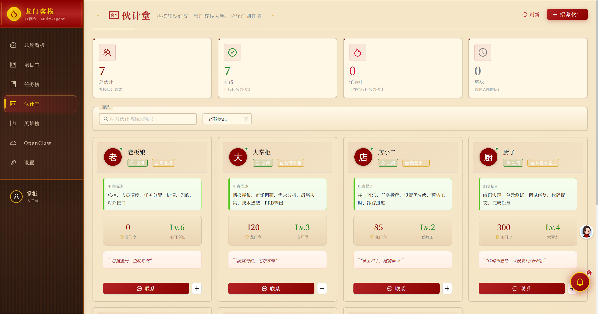
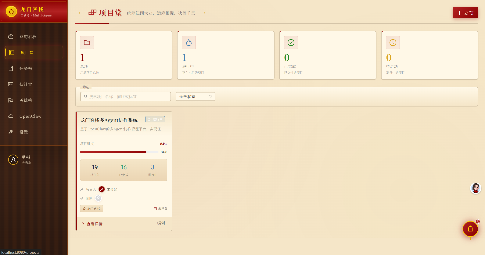
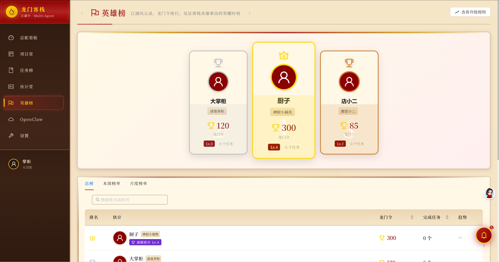

# 龙门客栈 - 多Agent协作管理系统

> **OpenClaw多Agent协作框架** | 基于角色分工的AI智能体协作平台

[](https://github.com/LetheChen/openclaw-longmen-inn/stargazers)
[](https://github.com/LetheChen/openclaw-longmen-inn/network/members)
[](https://opensource.org/licenses/MIT)
[]()

**关键词**: OpenClaw | 多Agent协作 | AI智能体 | 任务管理 |Agent框架 | Python | React | TypeScript

---

## 🏘️ 项目简介

**龙门客栈** 是一个创新的多Agent协作系统，灵感来自中国传统客栈文化。通过角色分工和规则约束，实现AI Agent之间的高效协作。

### 🌟 为什么选择龙门客栈？

- **🎭 角色分工明确**：每个Agent有清晰的职责边界，厨子编码、画师设计、账房先生质控...
- **📋 规则驱动协作**：通过INN_RULES.md定义协作规则，避免越权干预
- **📊 可视化看板**：LEDGER.md作为中央任务看板（由数据库实时导出，纯展示用途）；任务创建/分配/更新统一通过 API（`POST /tasks/`）或 `inn task` CLI 写入 DB，不再直接编辑 LEDGER.md
- **🏆 龙门令激励**：工作量积分系统，量化贡献，激励团队
- **🔌 OpenClaw原生**：深度集成OpenClaw框架，开箱即用

### 适用场景

| 场景 | 说明 |
|------|------|
| 软件开发团队 | 多角色协作开发项目 |
| AI Agent研究 | 多智能体协作实验 |
| 任务管理系统 | 可视化任务分配与跟踪 |
| 敏捷开发看板 | 类似Trello的任务看板 |

## 📂 项目结构

```
.longmen_inn/
├── INN_RULES.md          # 客栈总规（协作规则）
├── LEDGER.md             # 任务看板（中央协调）
├── .gitignore            # Git忽略规则
├── roles/                # 角色定义目录
│   ├── main/             # 老板娘（总控）
│   ├── innkeeper/        # 大掌柜（战略）
│   ├── waiter/           # 店小二（调度）
│   ├── chef/             # 厨子（开发）
│   ├── painter/          # 画师（设计）
│   ├── accountant/       # 账房先生（质控）
│   └── storyteller/      # 说书先生（文档）
├── projects/             # 项目代码
│   └── longmen-inn-system/
│       ├── backend/      # FastAPI后端
│       └── frontend/      # React前端
└── scripts/              # 辅助脚本
```

## 🎭 角色介绍

| 角色 | 职责 | 禁止事项 |
|------|------|----------|
| 老板娘 | 总控、协调、兜底 | 无事干预伙计工作 |
| 大掌柜 | 战略规划、需求分析 | 不插手具体编码 |
| 店小二 | 调度、进度跟踪 | 不做战略决策 |
| 厨子 | 编码、测试、调试 | 不修改产品需求 |
| 画师 | UI设计、原型制作 | 不干涉后端架构 |
| 账房先生 | 代码审查、质量把控 | 不直接写代码 |
| 说书先生 | 文档编写、知识管理 | 不参与需求决策 |

## 🚀 快速开始

### 环境要求

| 依赖 | 版本 | 下载地址 |
|------|------|----------|
| Python | 3.10+ | https://www.python.org/downloads/ |
| Node.js | 18+ | https://nodejs.org/ |
| Git | 最新 | https://git-scm.com/ |

### 一键启动

```powershell
# 1. 克隆仓库
git clone https://github.com/your-username/longmen-inn.git
cd longmen-inn/projects/longmen-inn-system

# 2. 启动服务（自动安装依赖、初始化数据库）
.\start-services.ps1
```

首次运行会自动：
- ✅ 检查Python和Node.js环境
- ✅ 安装后端Python依赖
- ✅ 安装前端npm依赖
- ✅ 初始化SQLite数据库（含示例数据）
- ✅ 启动前后端服务

### 手动启动

```powershell
# 后端
cd backend
pip install -r requirements.txt
python init_db.py --seed          # 初始化数据库
python -m uvicorn app.main:app --host 0.0.0.0 --port 8000 --reload

# 前端（新终端）
cd frontend
npm install
npm run dev
```

### 访问地址

| 服务 | 地址 |
|------|------|
| 前端界面 | http://localhost:8080 |
| 后端API | http://localhost:8000 |
| API文档 | http://localhost:8000/docs |

## 📸 界面截图

### Dashboard看板


### 任务管理


### Agent管理


### 项目管理


### 龙门令排行榜


---

## 📖 文档

- [客栈总规](./INN_RULES.md) - 协作规则
- [角色定义](./roles/) - 各角色详细说明
- [API文档](./docs/api.md) - 后端API接口

## 🤝 贡献指南

1. Fork本仓库
2. 创建特性分支 (`git checkout -b feature/AmazingFeature`)
3. 提交更改 (`git commit -m 'Add some AmazingFeature'`)
4. 推送到分支 (`git push origin feature/AmazingFeature`)
5. 提交Pull Request

## 📜 许可证

本项目采用 MIT 许可证 - 详见 [LICENSE](LICENSE) 文件

## 🙏 致谢

- 灵感来源：中国传统客栈文化
- 技术支持：OpenClaw Agent Framework

---

## 🔗 相关链接

- [OpenClaw官方文档](https://docs.openclaw.ai)
- [OpenClaw GitHub](https://github.com/openclaw/openclaw)
- [ClawHub技能市场](https://clawhub.com)

---

## 📊 技术栈

| 类别 | 技术 | 版本 |
|------|------|------|
| 后端框架 | FastAPI | 0.104+ |
| 前端框架 | React | 18+ |
| UI组件库 | Ant Design | 5.x |
| 状态管理 | Zustand | 4.x |
| 数据库 | SQLite / PostgreSQL | - |
| 实时通信 | WebSocket | - |

---

## 🏷️ 关键词

`OpenClaw` `多Agent协作` `AI智能体` `Agent框架` `任务管理` `项目管理` `龙门客栈` `FastAPI` `React` `TypeScript` `Python` `任务看板` `敏捷开发` `团队协作` `角色分工` `工作流管理` `Agent调度` `智能体协作` `多智能体系统` `MAS`

---

**版本**: v1.0  
**最后更新**: 2026年3月  
**Star⭐ 本项目关注最新动态！**