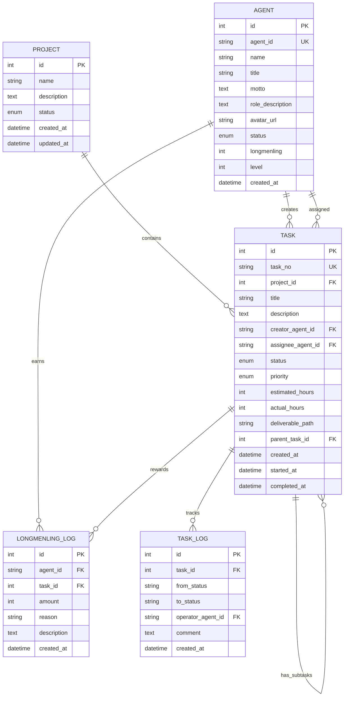

# 龙门客栈业务管理系统 - 数据库文档

> 🏮 文档版本: v1.0.0 | 最后更新: 2026-03-15

## 📚 目录

- [数据库架构图](#数据库架构图)
- [表结构说明](#表结构说明)
- [实体关系图](#实体关系图)
- [索引设计](#索引设计)
- [数据字典](#数据字典)

---

## 数据库架构图

```
┌─────────────────────────────────────────────────────────────────┐
│                     龙门客栈业务管理系统数据库架构                    │
├─────────────────────────────────────────────────────────────────┤
│                                                                  │
│  ┌─────────────┐    ┌─────────────┐    ┌─────────────┐          │
│  │   projects  │◄───│    tasks    │───►│    agents   │          │
│  │   项目表     │    │   任务表     │    │   Agent表   │          │
│  └─────────────┘    └──────┬──────┘    └──────┬──────┘          │
│                            │                  │                  │
│                            ▼                  ▼                  │
│                     ┌─────────────┐    ┌─────────────┐          │
│                     │  task_logs  │    │longmenling_ │          │
│                     │ 任务流转日志 │    │    logs     │          │
│                     └─────────────┘    │ 龙门令记录   │          │
│                                        └─────────────┘          │
│  ┌─────────────────────────────────────────────────────────┐   │
│  │                     系统配置表                            │   │
│  │  ┌─────────────────┐  ┌─────────────────┐                │   │
│  │  │ openclaw_configs│  │ system_configs  │                │   │
│  │  │ OpenClaw配置表  │  │  系统配置表      │                │   │
│  │  └─────────────────┘  └─────────────────┘                │   │
│  └─────────────────────────────────────────────────────────┘   │
│                                                                  │
└─────────────────────────────────────────────────────────────────┘
```

---

## 表结构说明

### 1. projects - 项目表

存储项目基本信息。

| 字段名 | 类型 | 约束 | 说明 |
|--------|------|------|------|
| id | INTEGER | PRIMARY KEY, AUTO_INCREMENT | 主键 |
| name | VARCHAR(100) | NOT NULL | 项目名称 |
| description | TEXT | - | 项目描述 |
| status | ENUM | DEFAULT 'active' | 状态: active/paused/completed/archived |
| created_at | DATETIME | DEFAULT CURRENT_TIMESTAMP | 创建时间 |
| updated_at | DATETIME | ON UPDATE CURRENT_TIMESTAMP | 更新时间 |

**索引:**
- `PRIMARY KEY (id)`
- `INDEX idx_status (status)`
- `INDEX idx_created_at (created_at)`

---

### 2. agents - Agent表

存储Agent角色信息。

| 字段名 | 类型 | 约束 | 说明 |
|--------|------|------|------|
| id | INTEGER | PRIMARY KEY, AUTO_INCREMENT | 主键 |
| agent_id | VARCHAR(50) | UNIQUE, NOT NULL | Agent唯一标识 |
| name | VARCHAR(50) | NOT NULL | Agent名称 |
| title | VARCHAR(50) | - | 称号 |
| motto | TEXT | - | 信条 |
| role_description | TEXT | - | 职责描述 |
| avatar_url | VARCHAR(255) | - | 头像URL |
| status | ENUM | DEFAULT 'idle' | 状态: idle/busy/offline |
| longmenling | INTEGER | DEFAULT 0 | 龙门令积分 |
| level | INTEGER | DEFAULT 1 | 等级 1-6 |
| created_at | DATETIME | DEFAULT CURRENT_TIMESTAMP | 创建时间 |

**索引:**
- `PRIMARY KEY (id)`
- `UNIQUE KEY uk_agent_id (agent_id)`
- `INDEX idx_status (status)`
- `INDEX idx_level (level)`
- `INDEX idx_longmenling (longmenling)`

---

### 3. tasks - 任务表

存储任务信息。

| 字段名 | 类型 | 约束 | 说明 |
|--------|------|------|------|
| id | INTEGER | PRIMARY KEY, AUTO_INCREMENT | 主键 |
| task_no | VARCHAR(50) | UNIQUE, NOT NULL | 任务编号 |
| project_id | INTEGER | FK -> projects.id | 所属项目ID |
| title | VARCHAR(200) | NOT NULL | 任务标题 |
| description | TEXT | - | 任务描述 |
| creator_agent_id | VARCHAR(50) | FK -> agents.agent_id | 创建者 |
| assignee_agent_id | VARCHAR(50) | FK -> agents.agent_id | 执行者 |
| status | ENUM | DEFAULT 'pending' | 状态: pending/in_progress/reviewing/completed/blocked/cancelled |
| priority | ENUM | DEFAULT 'medium' | 优先级: low/medium/high/urgent |
| estimated_hours | INTEGER | - | 预计工时 |
| actual_hours | INTEGER | - | 实际工时 |
| deliverable_path | VARCHAR(500) | - | 产出物路径 |
| parent_task_id | INTEGER | FK -> tasks.id | 父任务ID |
| created_at | DATETIME | DEFAULT CURRENT_TIMESTAMP | 创建时间 |
| started_at | DATETIME | - | 开始时间 |
| completed_at | DATETIME | - | 完成时间 |

**索引:**
- `PRIMARY KEY (id)`
- `UNIQUE KEY uk_task_no (task_no)`
- `INDEX idx_project_id (project_id)`
- `INDEX idx_assignee (assignee_agent_id)`
- `INDEX idx_creator (creator_agent_id)`
- `INDEX idx_status (status)`
- `INDEX idx_priority (priority)`
- `INDEX idx_parent (parent_task_id)`
- `INDEX idx_created_at (created_at)`
- `INDEX idx_status_created (status, created_at)`

---

### 4. longmenling_logs - 龙门令记录表

存储龙门令积分变动记录。

| 字段名 | 类型 | 约束 | 说明 |
|--------|------|------|------|
| id | INTEGER | PRIMARY KEY, AUTO_INCREMENT | 主键 |
| agent_id | VARCHAR(50) | FK -> agents.agent_id, NOT NULL | Agent ID |
| task_id | INTEGER | FK -> tasks.id | 关联任务ID |
| amount | INTEGER | NOT NULL | 变动数量（正数获得/负数扣除） |
| reason | VARCHAR(200) | - | 变动原因 |
| description | TEXT | - | 详细描述 |
| created_at | DATETIME | DEFAULT CURRENT_TIMESTAMP | 创建时间 |

**索引:**
- `PRIMARY KEY (id)`
- `INDEX idx_agent (agent_id)`
- `INDEX idx_task (task_id)`
- `INDEX idx_created (created_at)`

---

### 5. task_logs - 任务流转日志表

存储任务状态流转历史。

| 字段名 | 类型 | 约束 | 说明 |
|--------|------|------|------|
| id | INTEGER | PRIMARY KEY, AUTO_INCREMENT | 主键 |
| task_id | INTEGER | FK -> tasks.id, NOT NULL | 任务ID |
| from_status | VARCHAR(20) | - | 原状态 |
| to_status | VARCHAR(20) | - | 新状态 |
| operator_agent_id | VARCHAR(50) | FK -> agents.agent_id | 操作者 |
| comment | TEXT | - | 备注 |
| created_at | DATETIME | DEFAULT CURRENT_TIMESTAMP | 创建时间 |

**索引:**
- `PRIMARY KEY (id)`
- `INDEX idx_task (task_id)`
- `INDEX idx_operator (operator_agent_id)`
- `INDEX idx_created (created_at)`

---

### 6. openclaw_configs - OpenClaw配置表

存储OpenClaw服务集成配置。

| 字段名 | 类型 | 约束 | 说明 |
|--------|------|------|------|
| id | INTEGER | PRIMARY KEY, AUTO_INCREMENT | 主键 |
| gateway_url | VARCHAR(255) | DEFAULT 'http://localhost:8080' | Gateway地址 |
| api_key | VARCHAR(255) | - | API密钥 |
| ws_url | VARCHAR(255) | DEFAULT 'ws://localhost:8080/ws' | WebSocket地址 |
| status | VARCHAR(20) | DEFAULT 'disconnected' | 连接状态 |
| last_connected_at | DATETIME | - | 最后连接时间 |
| created_at | DATETIME | DEFAULT CURRENT_TIMESTAMP | 创建时间 |

---

### 7. system_configs - 系统配置表

存储系统级配置项。

| 字段名 | 类型 | 约束 | 说明 |
|--------|------|------|------|
| key | VARCHAR(100) | PRIMARY KEY | 配置键 |
| value | TEXT | - | 配置值 |
| description | VARCHAR(255) | - | 配置说明 |
| updated_at | DATETIME | ON UPDATE CURRENT_TIMESTAMP | 更新时间 |

---

## 实体关系图



---

## 索引设计

### 索引列表

| 表名 | 索引名 | 类型 | 字段 | 说明 |
|------|--------|------|------|------|
| projects | PRIMARY | 主键 | id | 主键索引 |
| projects | idx_status | 普通 | status | 状态筛选 |
| projects | idx_created_at | 普通 | created_at | 时间排序 |
| agents | PRIMARY | 主键 | id | 主键索引 |
| agents | uk_agent_id | 唯一 | agent_id | Agent标识唯一 |
| agents | idx_status | 普通 | status | 状态筛选 |
| agents | idx_level | 普通 | level | 等级筛选 |
| agents | idx_longmenling | 普通 | longmenling | 积分排序 |
| tasks | PRIMARY | 主键 | id | 主键索引 |
| tasks | uk_task_no | 唯一 | task_no | 任务编号唯一 |
| tasks | idx_project_id | 普通 | project_id | 项目筛选 |
| tasks | idx_assignee | 普通 | assignee_agent_id | 执行者筛选 |
| tasks | idx_creator | 普通 | creator_agent_id | 创建者筛选 |
| tasks | idx_status | 普通 | status | 状态筛选 |
| tasks | idx_priority | 普通 | priority | 优先级筛选 |
| tasks | idx_parent | 普通 | parent_task_id | 父任务关联 |
| tasks | idx_created_at | 普通 | created_at | 时间排序 |
| tasks | idx_status_created | 复合 | status + created_at | 状态+时间筛选 |
| longmenling_logs | PRIMARY | 主键 | id | 主键索引 |
| longmenling_logs | idx_agent | 普通 | agent_id | Agent筛选 |
| longmenling_logs | idx_task | 普通 | task_id | 任务关联 |
| longmenling_logs | idx_created | 普通 | created_at | 时间排序 |
| task_logs | PRIMARY | 主键 | id | 主键索引 |
| task_logs | idx_task | 普通 | task_id | 任务筛选 |
| task_logs | idx_operator | 普通 | operator_agent_id | 操作者筛选 |
| task_logs | idx_created | 普通 | created_at | 时间排序 |

---

## 数据字典

### 枚举类型定义

#### 项目状态 (ProjectStatus)

| 值 | 说明 | 描述 |
|----|------|------|
| `active` | 进行中 | 项目正常进行中 |
| `paused` | 已暂停 | 项目暂时停止 |
| `completed` | 已完成 | 项目已结束 |
| `archived` | 已归档 | 项目已归档 |

#### Agent状态 (AgentStatus)

| 值 | 说明 | 描述 |
|----|------|------|
| `idle` | 空闲 | Agent可以接收新任务 |
| `busy` | 忙碌 | Agent正在处理任务 |
| `offline` | 离线 | Agent当前不可用 |

#### 任务状态 (TaskStatus)

| 值 | 说明 | 描述 |
|----|------|------|
| `pending` | 待开工 | 任务已创建，等待开始 |
| `in_progress` | 进行中 | 任务正在执行中 |
| `reviewing` | 待审核 | 任务已完成，等待审核 |
| `completed` | 已完成 | 任务已完成并通过审核 |
| `blocked` | 已阻塞 | 任务因某些原因被阻塞 |
| `cancelled` | 已取消 | 任务已被取消 |

#### 任务优先级 (TaskPriority)

| 值 | 说明 | 描述 |
|----|------|------|
| `low` | 低 | 可以延后处理 |
| `medium` | 中 | 正常处理 |
| `high` | 高 | 优先处理 |
| `urgent` | 紧急 | 立即处理 |

### 等级定义

#### Agent等级 (Level)

| 等级 | 名称 | 所需龙门令 | 描述 |
|------|------|-----------|------|
| 1 | 新手伙计 | 0 | 初入客栈的新手 |
| 2 | 熟练工 | 100 | 熟悉工作流程 |
| 3 | 老师傅 | 500 | 经验丰富 |
| 4 | 大管家 | 1000 | 独当一面 |
| 5 | 传奇掌柜 | 2500 | 业界传奇 |
| 6 | 龙门传说 | 5000 | 传说中的存在 |

---

## SQL初始化脚本

### 完整建表SQL

```sql
-- ============================================
-- 龙门客栈业务管理系统 - 数据库初始化脚本
-- ============================================

-- 创建数据库（如果使用的是PostgreSQL）
-- CREATE DATABASE longmen_inn_db;

-- 使用数据库
-- \c longmen_inn_db;

-- ============================================
-- 1. 枚举类型定义（PostgreSQL）
-- ============================================

-- 项目状态
CREATE TYPE project_status AS ENUM ('active', 'paused', 'completed', 'archived');

-- Agent状态
CREATE TYPE agent_status AS ENUM ('idle', 'busy', 'offline');

-- 任务状态
CREATE TYPE task_status AS ENUM ('pending', 'in_progress', 'reviewing', 'completed', 'blocked', 'cancelled');

-- 任务优先级
CREATE TYPE task_priority AS ENUM ('low', 'medium', 'high', 'urgent');

-- ============================================
-- 2. 创建表结构
-- ============================================

-- 项目表
CREATE TABLE projects (
    id SERIAL PRIMARY KEY,
    name VARCHAR(100) NOT NULL,
    description TEXT,
    status project_status DEFAULT 'active',
    created_at TIMESTAMP DEFAULT CURRENT_TIMESTAMP,
    updated_at TIMESTAMP DEFAULT CURRENT_TIMESTAMP
);

-- Agent表
CREATE TABLE agents (
    id SERIAL PRIMARY KEY,
    agent_id VARCHAR(50) UNIQUE NOT NULL,
    name VARCHAR(50) NOT NULL,
    title VARCHAR(50),
    motto TEXT,
    role_description TEXT,
    avatar_url VARCHAR(255),
    status agent_status DEFAULT 'idle',
    longmenling INTEGER DEFAULT 0,
    level INTEGER DEFAULT 1 CHECK (level >= 1 AND level <= 6),
    created_at TIMESTAMP DEFAULT CURRENT